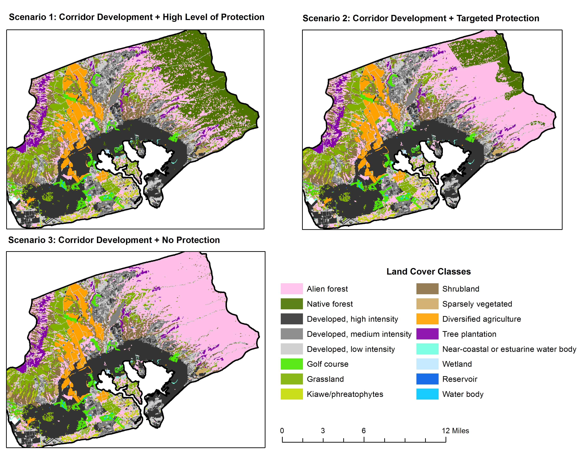
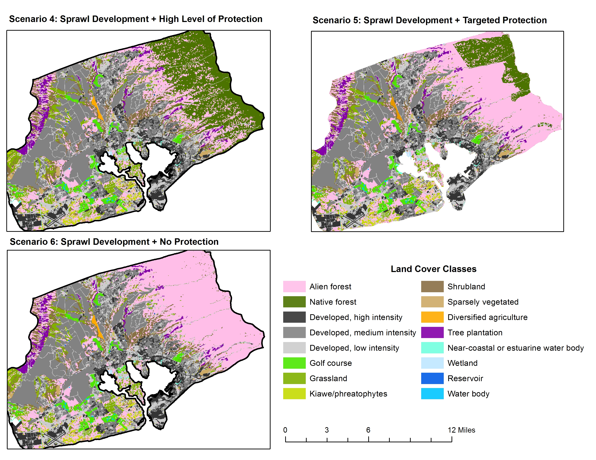

# Importing Land-Cover Scenarios

Instead of using shapes to modify land cover in the application, land-cover grids can be created externally and imported into the application for analysis.

Provided are six land cover scenario files representing different types of development around Pearl Harbor.

1. [Corridor Development: Scenario 1](https://github.com/ikewai/HIGRE-workshop/raw/main/assets/ph_75m_s1.asc)
2. [Corridor Development: Scenario 2](https://github.com/ikewai/HIGRE-workshop/raw/main/assets/ph_75m_s2.asc)
3. [Corridor Development: Scenario 3](https://github.com/ikewai/HIGRE-workshop/raw/main/assets/ph_75m_s3.asc)
4. [Sprawl Development: Scenario 4](https://github.com/ikewai/HIGRE-workshop/raw/main/assets/ph_75m_s4.asc)
5. [Sprawl Development: Scenario 5](https://github.com/ikewai/HIGRE-workshop/raw/main/assets/ph_75m_s5.asc)
6. [Sprawl Development: Scenario 6](https://github.com/ikewai/HIGRE-workshop/raw/main/assets/ph_75m_s6.asc)

The first three of these land-cover scenarios represent heavy development around the rail corridor (Figure 1) while the latter three represent more dispersed development (Figure 2). Each of these groups includes a scenario for high levels of protection, targeted protection, and no protection for surrounding forests.

*Figure 1: Rail corridor development scenarios*

*Figure 2: Sprawl development scenarios*

As an example, we will import scenario one and three side by side for comparison. Then demonstrate how the scenarios can be compared to each other directly by modifying the default land-cover used by the tool.

## Importing Scenarios

Once you have scenarios 1 and 3 downloaded from the above links, click the "New Map" button to bring up a second map. On the first map click the "Import" button on the right panel and select "Import Land Cover Raster" in the pop-up dialog and click "Select Files". Select the scenario 1 file. Repeat this process on the second map with the scenario 3 file.

**NOTE** Scenario 3 will pop up a warning message saying that background cells were modified. You can ignore this message. The tool will not modifications made to map cells designated as "background" (ocean).

Navigate to the groundwater-recharge visualization on each map. The map displaying scenario 1 which includes a high level of protection should have a smaller reduction in overall groundwater recharge than scenario 3 with no protection.

## Comparing Scenarios Directly

Instead of comparing the scenarios to the default land-cover scenario provided by the tool, it is also possible to compare them to each other directly.

To do this, import scenario 1 again, but click on "Advanced Options" and select "Overwrite default land-cover values". This will cause the default land cover and groundwater-recharge values for the application to be overwritten with this scenario. Any changes will then be compared to this instead of the application default.

Go to the groundwater-recharge visualization. You should see a change in recharge of 0.

Now import scenario 3 into the same map (without the overwrite option selected). This will provide groundwater-recharge changes relative to scenario 1.

---

[Previous: Importing Land-Cover Scenarios](./4_import_lc.md)

[Next: Map State Export/Import](./5_map_state.md)